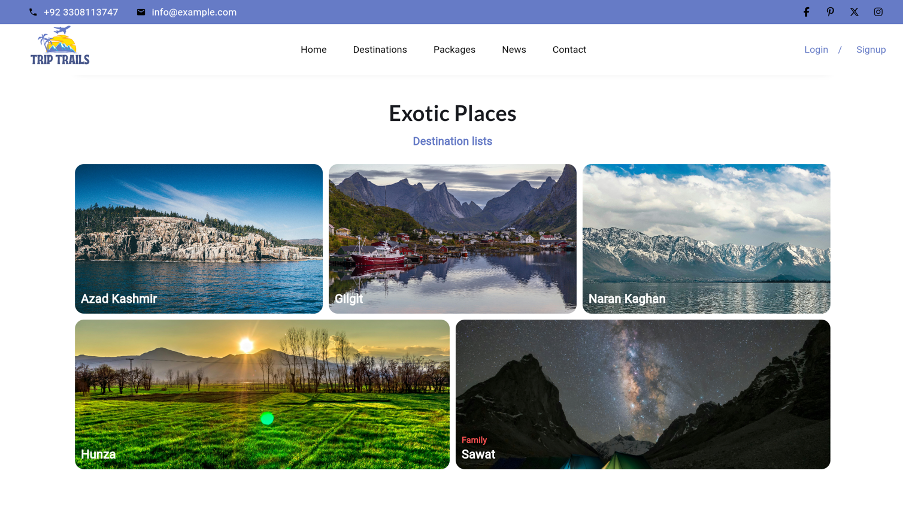
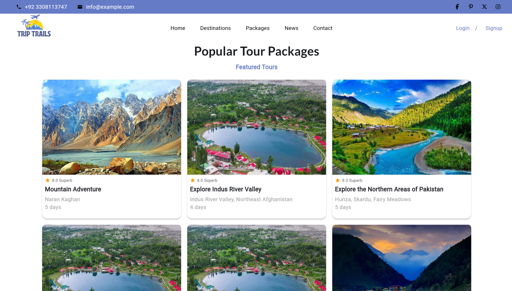
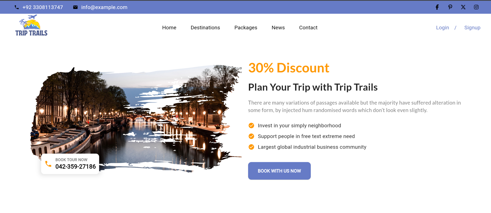

# Trip Trails

Trip Trails is a Flutter-based mobile application designed to help users explore and book tours in Pakistan's most iconic destinations. The app provides an intuitive interface for discovering popular tourist spots, saving favorite locations, and managing bookings—all within a user-friendly platform.

## Features

- **Onboarding Screens**: Introduce new users to the app's key features and functionalities.
- **User Authentication**: Secure login and signup process with account management.
- **City Selection**: Choose a city to explore its famous tourist spots.
- **Search Functionality**: Search for specific places or attractions within a selected city.
- **Favorites**: Save favorite locations for easy access later.
- **Detailed Place Information**: View detailed descriptions, locations, and images of tourist spots.
- **Tour Booking**: Book tours directly within the app, including selecting dates and viewing charges.
- **Cart Management**: Add tour details to the cart and proceed to checkout.
- **Profile Management**: View and update user details in the profile section.
- **Payment Integration**: Seamlessly proceed to payment after finalizing a booking.
- **Emergency Contacts**: Access important emergency numbers for each city.

## Admin Dashboard

The admin dashboard provides powerful tools for managing users, tours, and bookings:

- **User Management**: Create, edit, and delete user accounts.
- **Tour Management**: Add, edit, and delete tours for different cities.
- **Booking Management**: Monitor and manage user bookings and transactions.
- **Content Management**: Update city information, emergency contacts, and other content.
- **Reports and Analytics**: View reports on app usage, bookings, and user engagement.

HOME


DESTINATIONS


TOUR PACKAGES


NEWS


CONTACT


## APIs

The app relies on a robust backend with the following key APIs:

- **User Authentication API**: Manage user login, signup, and authentication tokens.
- **City and Places API**: Retrieve and manage city data and tourist spots.
- **Tour Booking API**: Handle tour bookings, including date selection and pricing.
- **Payment API**: Integrate with payment gateways to process transactions.
- **Favorites API**: Manage user favorites and stored locations.
- **Admin API**: Manage administrative tasks such as user management, tour updates, and booking oversight.

## Tech Stack

- **Frontend**: Flutter
- **Backend**: Node.js with MongoDB
- **State Management**: GetX
- **Payment Integration**: (Specify your payment gateway here)

## Getting Started

### Prerequisites

- Flutter SDK
- Node.js and MongoDB setup for backend
- API keys for payment gateway (if applicable)

### Installation

1. Clone the repository:
   ```bash
   git clone https://github.com/yourusername/trip-trails.git
